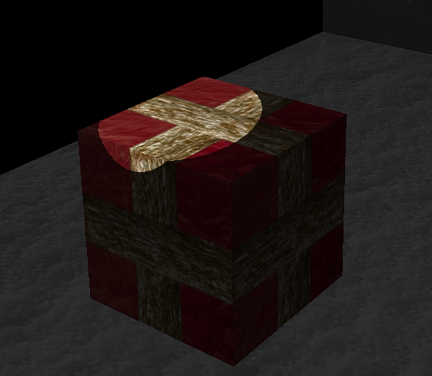

# 3DGraphics-Snowman-Scene

An assignment for the module 3d Computer Graphics. The task was to create a graphical scene from scratch using OpenGL and Java that depicted a snowman within a snowy setting. This entailed writing our own shaders, mesh's, cameras, textures, objects and lights. 

 

  

 

#### Camera

The user is able to 'fly' around the scene by moving the camera with the arrow keys. This funtionality also permits zooming in and out - see the above scene from a different position:

 

  

 

#### Animation

Further to this, there was a requirement to annimate the snowman (see the buttons at the bottom of the panel). You can make the snowman: rock, roll, slide or a combination of all three:

 

  

 

*Note: there is further animation whereby snow falls gradually in the background image.*

#### Lighting

Finally, there are two lights within the scene. The main light, acting as the sun, and the lamppost which casts a light as the top swivels around. Further buttons at the bottom of the panel permit the user to toggle both lights on and off seperately. See below the scene with the sunlight switched off:

 

  

 

*Note: a manipulation of the shaders permits various sophisticated affects. For instance, various textures appearing more shiny than others (known as a specular highlight) - such as the ribbon on the present: 

 

  

 
